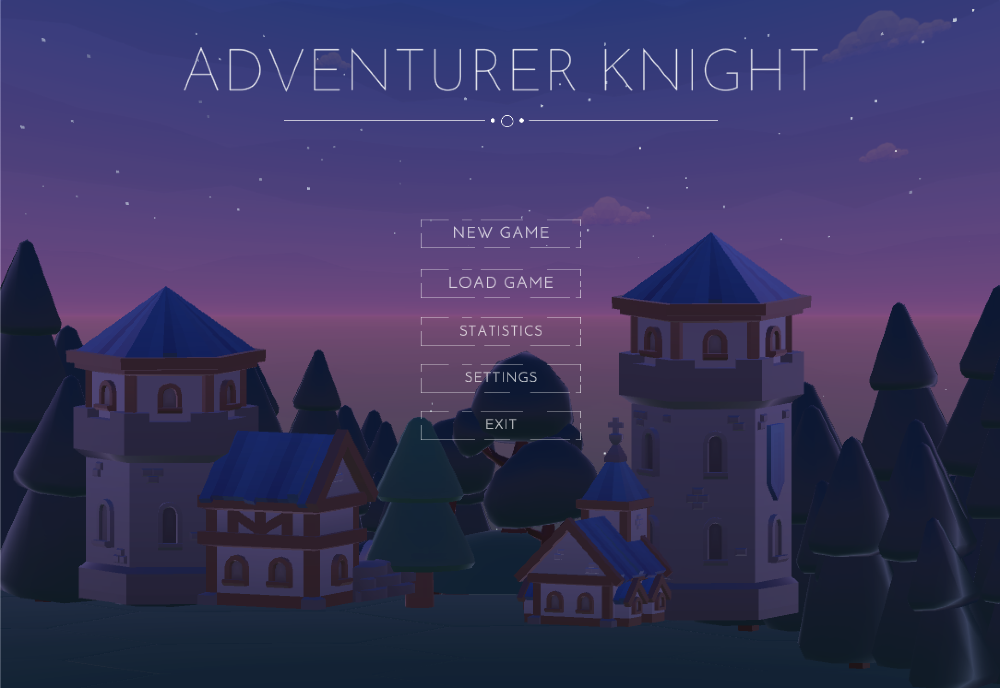
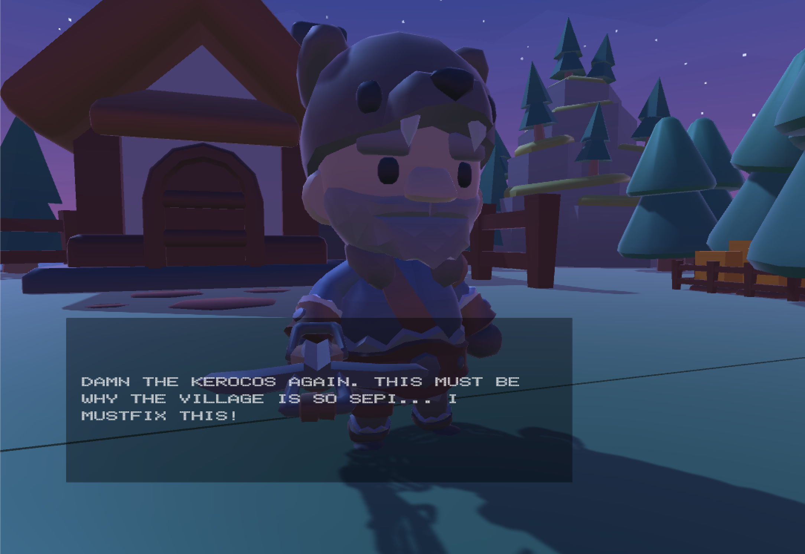
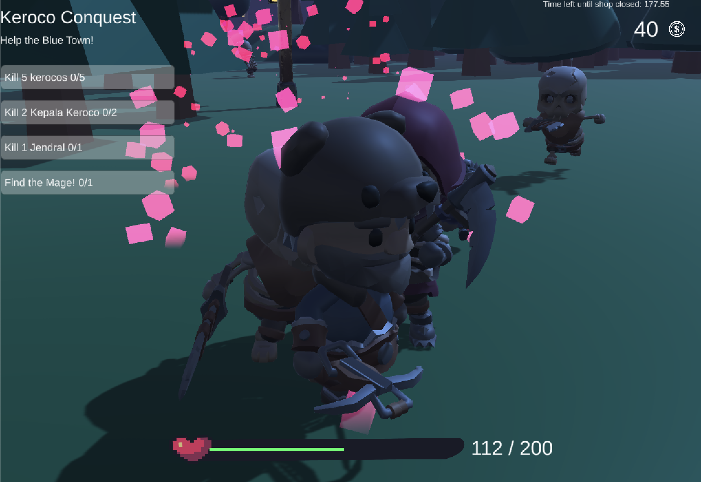
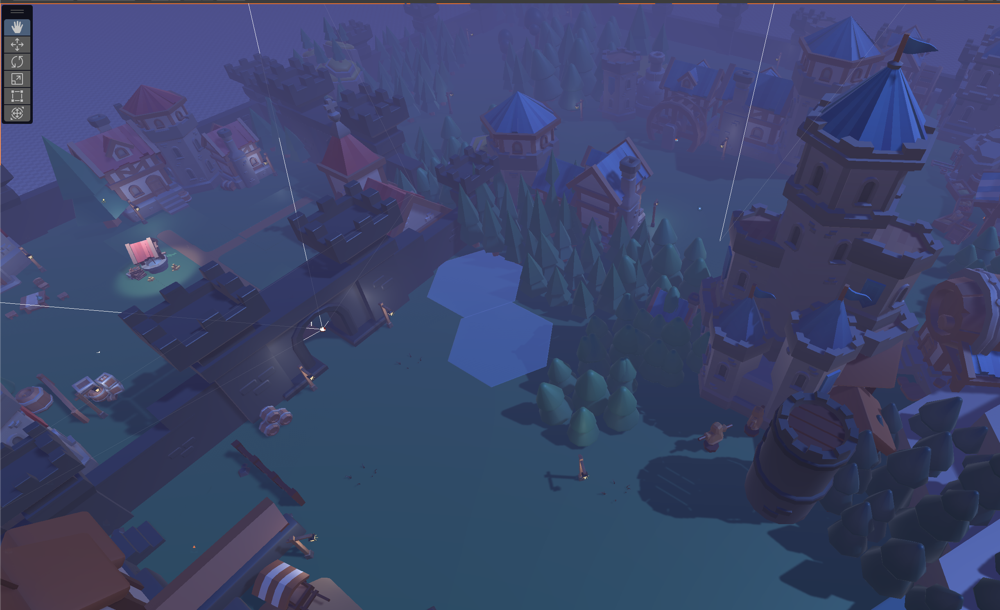

# IF3210-2024-Unity-011

## Knight Adventures: The Game

Knight Adventures is a third-person shooter game developed using Unity. In this thrilling adventure, players step into the shoes of Joko, the courageous hero of our story. The game begins when Joko encounters Kiki the Rouge, who has lost her chicken during a devastating attack by the Kerocos.

As the narrative unfolds, it becomes clear that the entire village and neighboring towns are besieged by the Keroco threat. Joko's mission is to rescue the town and seek out the wise Mage, who hold the knowledge of the Keroco;s lair, nestled in the kingdom adjacent to the graveyard. The ultimate confrontation awaits Joko in this eerie domain, where he must face the Keroco King!

"Knight Adventures" features four quests, each rich with challenges and mysteries. Additionally, players can use strategic cheats provided in the guide below to enhance their gameplay experience. Enjoy the quest!

`Built for the fulfillment of IF3210 Platform-Based Development Project 2`

## Cheats

Type this during gameplay to activate the cheats!

- **fakhrikebal**: [NO_DAMAGE] The player's HP will not decrease when attacked by mobs.
- **yonikerad**: [ONE_HIT_KILL] A single attack from the player will instantly kill the mob being attacked.
- **alisharich**: [MOTHERLODE] The player will receive an infinite amount of money.
- **akbargece**: [TWO_TIMES_SPEED] The movement speed of the player is doubled.
- **yonikebal**: [FULL_HP_PET] The pet's HP will not decrease when attacked by mobs.
- **bunuhyoni**: [KILL_PET] Instantly kill the pet.
- **orbwangy**: [ORB] The player will immediately receive an orb power-up.
- **lanjutbang**: [SKIP] The player can skip the level currently being played.
- **matiaja**: [KILL] Kill Joko :(
- **skilltime**: [SKILL] Use Skill and activate cutscene.

## Library Used
- **TMPro**: Text Library used for UI in Canvas
- **Cinemachine**: Library used for managing cutscenes
- **AI Navigation**: Library used for AI Movement Navigation (retrieved from: https://docs.unity3d.com/Packages/com.unity.ai.navigation@2.0/manual/index.html)

# Screenshot

Here's a few screenshot! The rest will be available at the Screenshot folder.

### Main Menu

### Joko

### The Combat

### The map

### Made by

| NIM      | Name                    | Features                                                                      | Hours Spent |
|----------|-------------------------|-------------------------------------------------------------------------------|-------------|
| 13521045 | Fakhri Muhammad Mahendra | Shopkeeper, Orb Power Up, Save Game, Cheat, Quests, Game Manager            |             |
| 13521087 | Razzan Daksana Yoni      | Main menu, Pet Movement, Pet Mobs, Pet Players                                                              |             |
| 13521093 | Akbar Maulana Ridho      | Cheat, All Mobs, Hitbox, Hurtbox, Mobs AI Movement, Mobs Weapon, Game Manager |             |
| 13521101 | Arsa Izdihar Islam       | Entity, Statistik Game, Weapon, Cheat, Build Android, Multitype Input, Game Manager, Player Movements |             |
| 13521171 | Alisha Listya            | Cutscenes, Skill Cutscene, Game Over, World Building, UI (Health Bar, Gold), Story, Asset Search                      |             |
